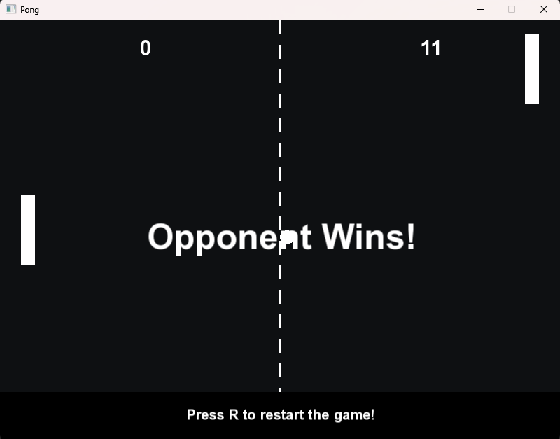

# Pong Game

A simple Pong game built with **C++** and **SFML 3.0.0**.  
The basic gameplay is ready, but I may improve it in the future.

## Controls
- **Space**: Start the game
- **W / S**: Move left paddle up / down  
- **P**: Pause/Resume the game
- **R**: Restart game
- **Esc**: Quit game  

## Requirements
- C++17 (or later)  
- [SFML 3.0.0](https://www.sfml-dev.org/)  

## Screenshots

